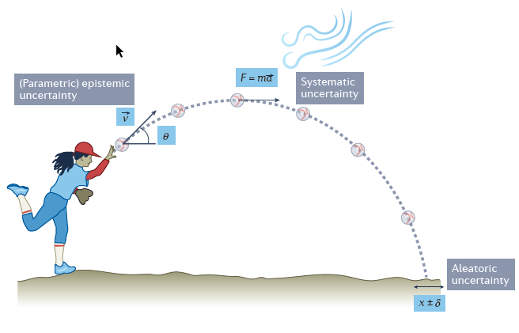
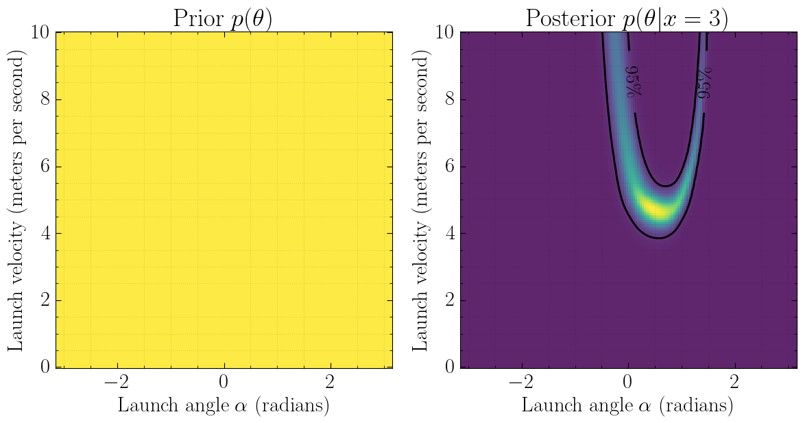
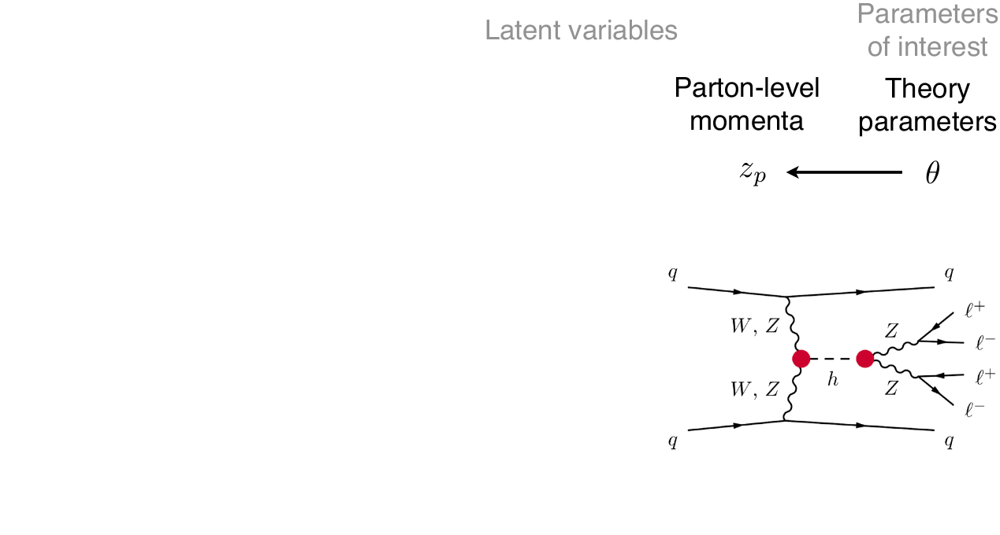
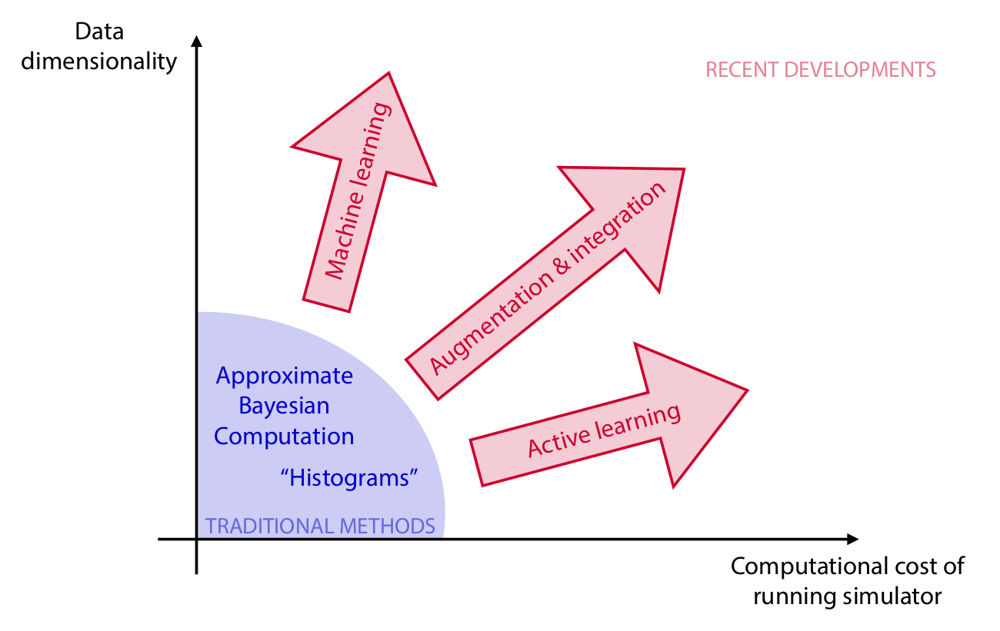
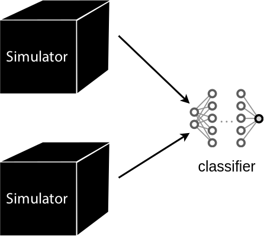
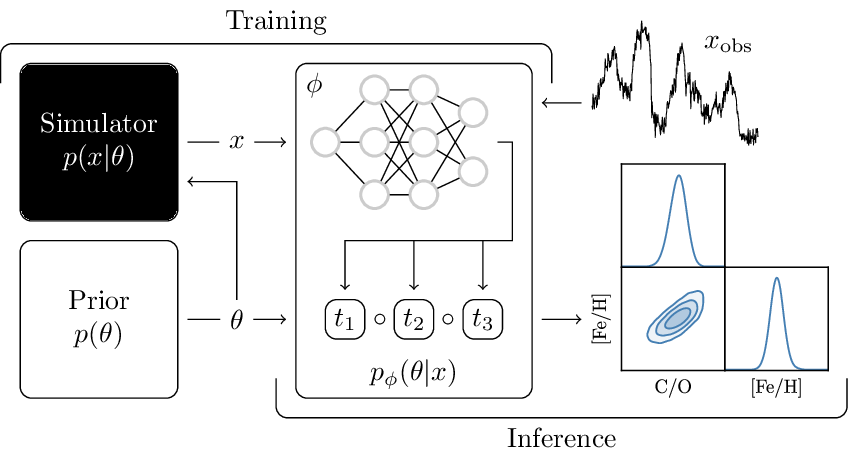
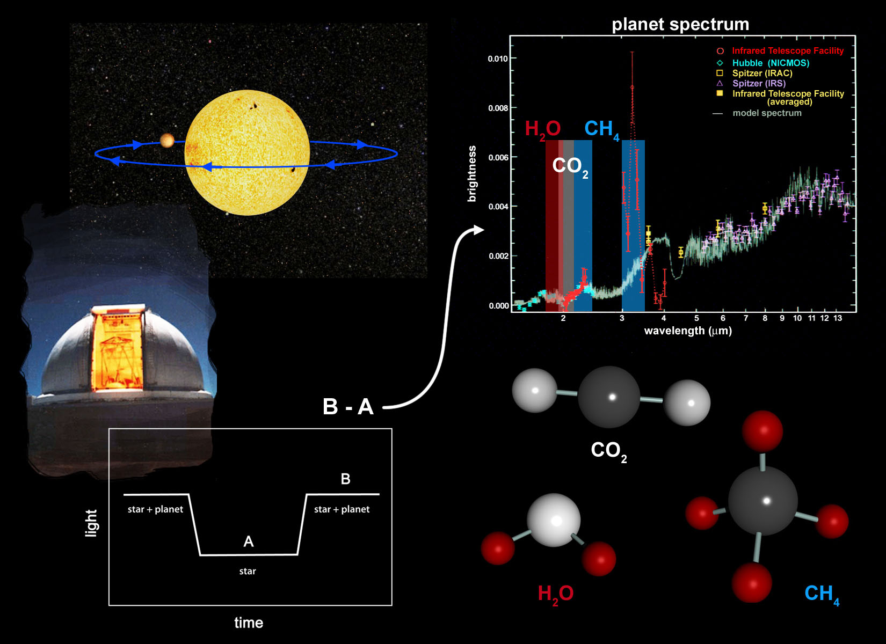
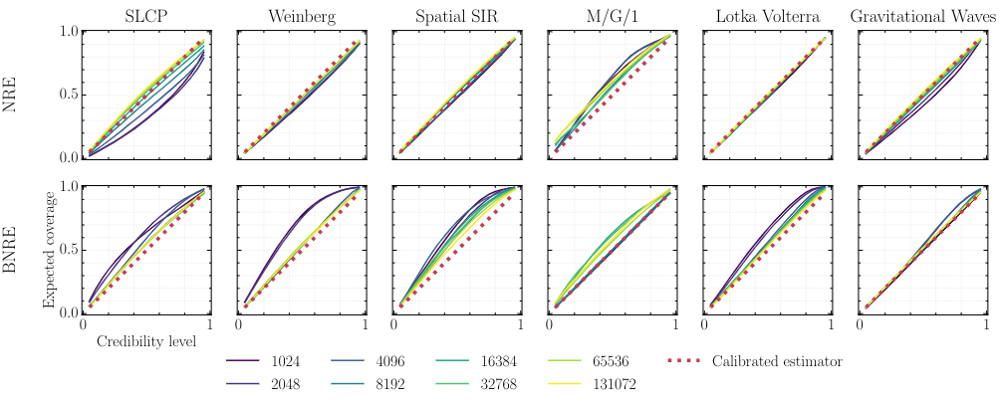
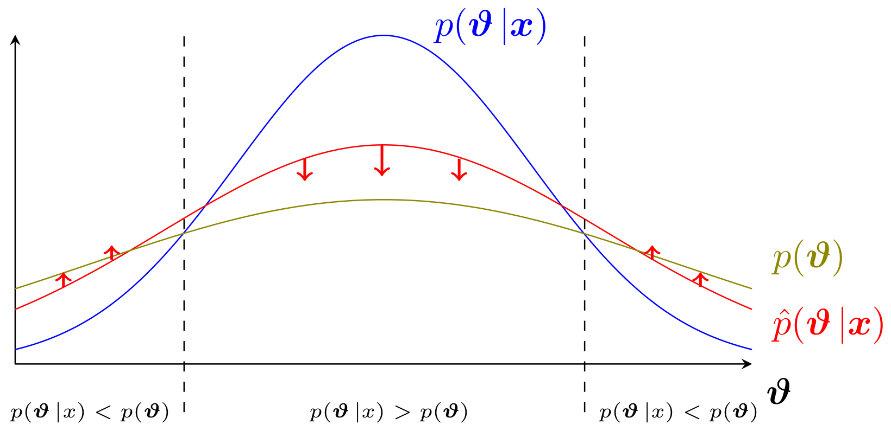

class: middle, center, title-slide

# An introduction to<br>simulation-based inference

<br>

51st SLAC Summer Institute<br>
August 15, 2023

<br>

Gilles Louppe<br>
[g.louppe@uliege.be](mailto:g.louppe@uliege.be)<br>
[@glouppe](https://twitter.com/glouppe)

---

class: middle, center

.center.width-80[]

---

class: middle

$$
v_x = v \cos(\alpha),~~ v_y = v \sin(\alpha),
$$

$$
\frac{dx}{dt} = v_x,~~\frac{dy}{dt} = v_y, \frac{dv_y}{dt} = -G.
$$

---

class: middle

```python
def simulate(v, alpha, dt=0.001):
    v_x = v * np.cos(alpha)  # x velocity m/s
    v_y = v * np.sin(alpha)  # y velocity m/s
    y = 1.1 + 0.3 * random.normal()
    x = 0.0

    while y > 0: # simulate until ball hits floor
        v_y += dt * -G  # acceleration due to gravity
        x += dt * v_x
        y += dt * v_y

    return x + 0.25 * random.normal()
```

---

class: middle, center

.center.width-100[]

---

class: middle, center

What parameter values $\theta$ are the most plausible?

---

class: middle

.center.width-100[]

---

# Outline

1. Simulation-based inference
2. Algorithms
    - Neural ratio estimation
    - Neural posterior estimation 
    - Neural score estimation
3. Diagnostics

???

Check https://github.com/smsharma/sbi-lecture-mit/blob/main/tutorial.ipynb

---

class: middle
count: false

# Simulation-based inference

---

class: middle

## Scientific simulators

.center.width-100[]

---

class: middle

.center.width-70[]

.center[$$\theta, z, x \sim p(\theta, z, x)$$]

---

class: middle, center

.center.width-70[]

.center[$$\theta, z \sim p(\theta, z | x)$$]

???

Take the bean machine example.

---

class: middle

.width-100[]

???

generation: pencil and paper calculable from first principles

---

count: false
class: middle

.width-100[]

???

parton shower + hadronization: controlled approximation of first principles + phenomenological model

---

count: false
class: middle

.width-100[]

???

detector simulation: interaction with the materials and digitization

---

count: false
class: middle

.width-100[]

???

reconstruction simulation

---

class: middle

$$p(x|\theta) = \underbrace{\iiint}\_{\text{yikes!}} p(z\_p|\theta) p(z\_s|z\_p) p(z\_d|z\_s) p(x|z\_d) dz\_p dz\_s dz\_d$$

???

That's bad!

---

class: middle

## Bayesian inference 

Start with
- a simulator that can generate $N$ samples $x\_i \sim p(x\_i|\theta\_i)$,
- a prior model $p(\theta)$,
- observed data $x\_\text{obs} \sim p(x\_\text{obs} | \theta\_\text{true})$.

Then, estimate the posterior $$p(\theta|x\_\text{obs}) = \frac{p(x\_\text{obs} | \theta)p(\theta)}{p(x\_\text{obs})}.$$

---

class: middle

.center.width-100[]

---

class: middle
count: false

# Algorithms

---


class: middle

.avatars[]

.center.width-100[]

.footnote[Credits: [Cranmer, Brehmer and Louppe](https://doi.org/10.1073/pnas.1912789117), 2020.]

---

class: middle

## Approximate Bayesian Computation (ABC)

.center.width-100[]

.italic[Issues:]
- How to choose $x'$? $\epsilon$? $||\cdot||$?
- No tractable posterior.
- Need to run new simulations for new data or new prior.

.footnote[Credits: Johann Brehmer.]

---

class: middle

.avatars[]

.center.width-100[]

.footnote[Credits: [Cranmer, Brehmer and Louppe](https://doi.org/10.1073/pnas.1912789117), 2020.]

---

class: middle
count: false

.avatars[]

.center.width-100[]

.footnote[Credits: [Cranmer, Brehmer and Louppe](https://doi.org/10.1073/pnas.1912789117), 2020.]

---

# Neural ratio estimation 

.avatars[]

<br>
The likelihood-to-evidence $r(x|\theta) = \frac{p(x|\theta)}{p(x)} = \frac{p(x, \theta)}{p(x)p(\theta)}$ ratio can be learned, even if neither the likelihood nor the evidence can be evaluated:
<br><br>
.grid[
.kol-1-4.center[

<br>

$x,\theta \sim p(x,\theta)$

<br><br><br><br>

$x,\theta \sim p(x)p(\theta)$

]
.kol-5-8[<br>.center.width-70[]]
.kol-1-8[<br><br><br><br>

$\hat{r}(x|\theta)$]
]

.footnote[Credits: [Cranmer et al](https://arxiv.org/pdf/1506.02169.pdf), 2015; [Hermans et al](http://proceedings.mlr.press/v119/hermans20a/hermans20a.pdf), 2020.]

---

class: middle

.avatars[]

The solution $d$ found after training  approximates the optimal classifier
$$d(x, \theta) \approx d^\*(x, \theta) = \frac{p(x, \theta)}{p(x, \theta)+p(x)p(\theta)}.$$
Therefore, $$r(x|\theta) = \frac{p(x|\theta)}{p(x)} = \frac{p(x, \theta)}{p(x)p(\theta)} \approx \frac{d(x, \theta)}{1-d(x, \theta)} = \hat{r}(x|\theta).$$

???

Derive on blackboard.

---

class: middle

.avatars[]

.center.width-100[]

$$p(\theta|x) \approx \hat{r}(x|\theta) p(\theta) $$

---

background-image: url(./figures/sbi/stellar.jpeg)
background-position: left
class: black-slide

.avatars[]

.smaller-x[ ]
## Constraining dark matter with stellar streams 

<br><br><br><br><br><br>
.pull-right[
  
<iframe width="360" height="270" src="https://www.youtube.com/embed/uQVv_Sfxx5E?&loop=1&start=0" frameborder="0" volume="0" allowfullscreen></iframe>

]

.footnote[Image credits: C. Bickel/Science; [D. Erkal](https://t.co/U6KPgLBdpz?amp=1).].]

---

class: middle

.avatars[]

.center.width-90[]

.center[
.width-35[]
.width-35[]

]

.footnote[Credits: [Hermans et al](https://arxiv.org/pdf/2011.14923), 2021.]

---

class: black-slide, center, middle

.width-100[]

Preliminary results for GD-1 suggest a .bold[preference for CDM over WDM].

---

# Neural Posterior Estimation 

<br>

.center.width-90[]

$$\begin{aligned}
&\min\_{q\_\phi} \mathbb{E}\_{p(x)}\left[ \text{KL}( p(\theta|x) || q\_\phi(\theta|x) ) \right]
\end{aligned}$$

???

Derive on blackboard

$$
\begin{aligned}
&\min\_{q\_\phi} \mathbb{E}\_{p(x)}\left[ \text{KL}( p(\theta|x) || q\_\phi(\theta|x) ) \right] \\\\
=& \min\_{q\_\phi} \mathbb{E}\_{p(x)} \mathbb{E}\_{p(\theta|x)} \left[\log \frac{p(\theta|x)}{q\_\phi(\theta|x)} \right] \\\\
=& \max\_{q\_\phi} \mathbb{E}\_{p(x, \theta)} \left[ \log q\_\phi(\theta|x) \right]
\end{aligned}$$

---

class: middle

## Normalizing flows

A normalizing flow is a sequence of invertible transformations $f\_k$ that map a simple distribution $p\_0$ to a more complex distribution $p\_K$:

.center.width-100[]

By the change of variables formula, the log-likelihood of a sample $x$ is given by
$$\log p(\mathbf{x}) = \log p(\mathbf{z}\_0) - \sum\_{k=1}^K \log \left| \det J\_{f\_k}(\mathbf{z}\_{k-1}) \right|.$$

---

class: middle, black-slide

## Exoplanet atmosphere characterization 

.center.width-95[]

.footnote[Credits: [NSA/JPL-Caltech](https://www.nasa.gov/topics/universe/features/exoplanet20100203-b.html), 2010.]

---

class: middle

.avatars[]

.center[
.width-25[]
.width-70[]
]

.footnote[Credits: [Vasist et al](https://doi.org/10.1051/0004-6361/202245263), 2023.]

---

class: middle
count: false

# Diagnostics

---

class: middle

.grid[
.kol-1-2[
<br>
$$\hat{p}(\theta|x) = \text{sbi}(p(x | \theta), p(\theta), x)$$

We must make sure our approximate simulation-based inference algorithms can (at least) actually realize faithful inferences on the (expected) observations.

]
.kol-1-2[.center.width-80[]

.center.italic[How do we know this is good enough?]]
]

---

class: middle

.avatars[]

## Mode convergence

The maximum a posteriori estimate converges towards the nominal value $\theta^\*$ for an increasing number of independent and identically distributed observables $x\_i \sim p(x|\theta^\*)$:
$$\begin{aligned}
&\lim\_{N \to \infty} \arg\max\_\theta p(\theta | \\{ x\_i \\}\_{i=1}^N) \\\\
=& \lim\_{N \to \infty} \arg\max\_\theta p(\theta) \prod\_{x\_i} r(x\_i | \theta) = \theta^\*
\end{aligned}$$

.center.width-100[]

.footnote[Credits: [Brehmer et al](https://iopscience.iop.org/article/10.3847/1538-4357/ab4c41/meta), 2019.]

---

class: middle

.avatars[]

.grid[
.kol-2-3[

<br>

## Coverage diagnostic

- For $x,\theta \sim p(x,\theta)$, compute the $1-\alpha$ credible interval based on $\hat{p}(\theta|x)$.
- If the fraction of samples for which $\theta$ is contained within the interval is larger than the nominal coverage probability $1-\alpha$, then the approximate posterior $\hat{p}(\theta|x)$ has coverage.]
.kol-1-3[
.center.width-100[]
.center.width-95[]
]
]

.footnote[Credits: [Hermans et al](https://arxiv.org/abs/2110.06581), 2021; [Siddharth Mishra-Sharma](https://arxiv.org/abs/2110.01620), 2021.]

---

class: middle

.avatars[]

<br>

.center.width-90[]

.footnote[Credits: [Hermans et al](https://arxiv.org/abs/2110.06581), 2021.]

---

class: middle, center

What if diagnostics fail?

???

- Use more data
- Use better NN architectures
- Use an ensemble

---

# Balanced NRE

.avatars[]

Enforce neural ratio estimation to be .bold[conservative] by using binary classifiers $\hat{d}$ that are balanced, i.e. such that
$$
\mathbb{E}\_{p(\theta,x)}\left[\hat{d}(\theta,x)\right] = \mathbb{E}\_{p(\theta)p(x)}\left[1 - \hat{d}(\theta,x)\right].
$$

<br>

.center.width-100[]

.footnote[Credits: [Delaunoy et al](https://arxiv.org/abs/2208.13624), 2022.]

---

class: middle

.avatars[]

.center.width-105[]

.footnote[Credits: [Delaunoy et al](https://arxiv.org/abs/2208.13624), 2022.]

---

# Summary

.success[Advances in deep learning have enabled new approaches to statistical inference.]

.success[This is major evolution in the statistical capabilities for science, as it enables the analysis of complex models and data without simplifying assumptions.]

.alert[Inference remains approximate and requires careful validation.]

.alert[Obstacles remain to be overcome, such as the curse of dimensionality and the need for large amounts of data.]

---

class: end-slide, center, middle
count: false

The end.